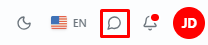
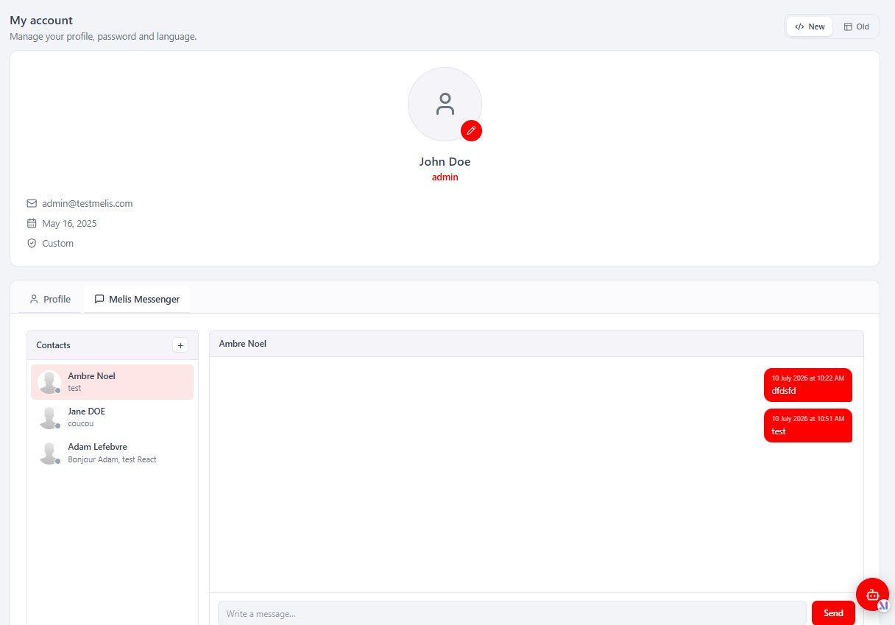

# MelisMessenger (React back-office) — Functional & Technical Documentation (for AI)

> **What this is.** MelisMessenger is the platform's **internal messaging system** — back-office
> collaborators talk to each other. This document covers it **in the new React back-office**
> (`/melis-react`). It is a **special brick**: **not a left-menu tool**. Instead it contributes
> **two host surfaces** — a **topbar notification icon** (unread-count badge) and a **"Melis
> Messenger" tab inside "My Account"** (a native React chat panel). It ships **no** `react-api`
> and **no** capabilities of its own: the two React components reuse the module's **existing
> legacy JSON endpoints** (`/melis/MelisMessenger/MelisMessenger/…`). For the data model and the
> `MelisMessengerService`, see the [legacy doc](./MelisMessenger.md); this doc does not repeat them.
>
> **How this document is organised — two clearly separated parts:**
> - **[Part A — Functional Guide](#part-a--functional-guide)** — for everyday users (and the
>   chat assistant) using the React back-office. Plain language.
> - **[Part B — Technical Reference](#part-b--technical-reference)** — for developers and AI
>   building inside the React UI, with code (brick registration, endpoints).
>
> **Audience**: consumed by the **MelisAI** MCP. **Status**: reviewed 2026-08-19.

---

## 0. Where this lives in the React back-office — read this first

- **Brick kind: special native-React brick — NOT a left-menu tool.** The manifest declares
  `route: null`, `forwardKey: null`, `melisKey: null` — so it has **no sidebar entry and no tree
  route**. It exists purely to plug **two widgets** into host extension points:
  1. a **topbar notification icon** (component `MessengerHeader.tsx`), rendered next to the
     language switcher, showing an **unread-message badge**;
  2. a **"Melis Messenger" tab inside "My Account"** (component `MessengerTab.tsx`), a native React
     chat panel added modularly to the profile's tab bar.
- **Activation-gated.** Both surfaces appear **only when the `MelisMessenger` module is active**
  (the account tab is guarded by `window.__melisIsModuleActive('MelisMessenger')`; the header is
  registered through the brick, which the host only loads for active modules).
- **No React API, no capabilities.** There is **no** `config/react-api.php` and **no**
  `config/react.capabilities.php`. The React components call the module's **legacy JSON
  endpoints** directly (see §B3). Business logic stays server-side in `MelisMessengerService`
  (legacy doc §B3).
- **"My Account" is native React**, and the Messenger tab is native React too. A **New / Old**
  toggle on the account page lets you fall back to the legacy profile in an iframe — in that
  case `MessengerHeader` drives the iframe DOM to open the legacy Messenger tab instead.
- Cross-reference: [MelisMessenger.md](./MelisMessenger.md) (legacy tool, data model, service).

---
---

# PART A — Functional Guide

## A1. What you can do with MelisMessenger in the new back-office

- **Message other platform users** — start a conversation with a colleague and exchange messages.
- **Get notified anywhere** — a **messenger icon in the top bar** shows a red badge with your
  number of unread messages, from any screen of the React back-office.
- **Chat from My Account** — a **Melis Messenger** tab inside **My Account** holds your
  conversations, the open thread, a contact list and a send box.
- **Keep up to date automatically** — the badge and the thread refresh on a timer, when the
  browser tab regains focus, and as soon as you open a conversation (which clears its unread mark).

## A2. Finding it in /melis-react

There is **no sidebar entry** for Messenger. You reach it two ways:

**The top-bar icon.** A chat bubble sits in the back-office header, next to the language switcher.
When you have unread messages a red badge shows the count (`99+` above 99). Click it to jump
straight to **My Account** with the **Melis Messenger** tab pre-selected.


*The top-bar messenger icon (highlighted) sitting next to the language switcher and the other header widgets. A red badge appears on it when you have unread messages.*

## A3. The Melis Messenger tab (in My Account)

**Where:** header messenger icon → **My Account** → **Melis Messenger** tab (chat-bubble icon,
next to **Profile**). It is a native React panel.

There you see, side by side, your **Contacts** (conversations, most-recent first), and the
**conversation** of the selected contact with message bubbles (yours on the right). A **+** button
in the Contacts header opens a **New conversation** search to pick a user by typing their name,
and a box at the bottom lets you **write and Send** a message. Opening a conversation marks it as
read, so the header badge drops immediately.


*The React "Melis Messenger" tab inside My Account — the Contacts list (with "+" to start a new conversation), the selected conversation's thread of message bubbles, and the "Write a message… / Send" composer. The New/Old toggle (top-right) can fall back to the legacy profile.*

> **Tip:** on a narrow screen the tab collapses to **one column at a time** (Contacts *or* the
> conversation) with a **←** back button, like a mobile chat app.

## A4. Common tasks — "How do I…?"

- **See if I have new messages** → glance at the **messenger icon** in the header (red badge = unread).
- **Open Messenger fast** → click the **header messenger icon** → lands on My Account → Melis Messenger.
- **Message a colleague** → My Account → **Melis Messenger** → **+** → type a name → pick the user → write → **Send**.
- **Read / continue a conversation** → My Account → Melis Messenger → click the contact in the list.
- **Compare with the classic profile** → My Account → top-right **New / Old** toggle → **Old**.

---
---

# PART B — Technical Reference

## B1. React presence at a glance

| Item | Value |
|---|---|
| Brick kind | **Special native-React brick — no menu tool** (contributes a topbar Header widget + a My-Account tab) |
| Brick id | `messenger` (matches `brick.tsx` ⇄ `brick.manifest.json`) |
| Manifest `route` | `null` (no route — not a routed page) |
| `label` | `Messenger` |
| `forwardKey` | `null` (no menu mapping) |
| `melisKey` | `null` (no rights-bearing menu node) |
| `entry` | `brick.js` |
| React API (`config/react-api.php`) | **None** — reuses legacy endpoints (§B3) |
| Capabilities (`config/react.capabilities.php`) | **None** — no module-specific capability keys |
| Host surface 1 | **Topbar icon** `MessengerHeader.tsx`, via `window.__melisRegisterBrick({ id:'messenger', Header })` |
| Host surface 2 | **My-Account tab** `MessengerTab.tsx`, via `window.__melisAccountTabs.push({ id:'messenger', … })` |
| Activation-gated | Yes (`window.__melisIsModuleActive('MelisMessenger')` + brick only loaded for active modules) |
| Tables (owned) | `melis_messenger_msg`, `melis_messenger_msg_members`, `melis_messenger_msg_content` — see [legacy doc §B2](./MelisMessenger.md) |

## B2. The brick — anatomy

Source in `ui-react/` (Vite **IIFE**, React/ReactRouter externalised to the host globals
`MelisReact*` / `MelisReactRouterDOM`, output to `public/ui-react/brick.js` next to
`brick.manifest.json` — see `ui-react/vite.config.ts`).

Manifest (`public/ui-react/brick.manifest.json`) — note the **nulls** (this brick is not a tool):
```json
{ "id": "messenger", "route": null, "label": "Messenger",
  "forwardKey": null, "melisKey": null, "entry": "brick.js" }
```

`ui-react/src/brick.tsx` registers **two host surfaces** for the id `messenger`:
```tsx
// 1) My-Account tab — modular extension point (present iff the module is active)
if (!window.__melisAccountTabs) window.__melisAccountTabs = []
if (window.__melisIsModuleActive?.('MelisMessenger') /* default true on old hosts */
    && !window.__melisAccountTabs.some((t) => t.id === 'messenger')) {
  window.__melisAccountTabs.push({
    id: 'messenger', label: 'Melis Messenger', icon: <ChatIcon />, order: 10,
    render: () => <MessengerTab />,
  })
  window.dispatchEvent(new CustomEvent('melis-account-tabs-changed'))
}

// 2) Topbar icon — the brick's Header widget (also enables __melisIsModuleActive detection)
window.__melisRegisterBrick?.({ id: 'messenger', Header: MessengerHeader })
```

React components (`ui-react/src/`):

| File | Role |
|---|---|
| `brick.tsx` | Entry point. Registers the **Header** widget (`__melisRegisterBrick`) and pushes the **My-Account tab** into `window.__melisAccountTabs`. Both gated on `__melisIsModuleActive('MelisMessenger')`. |
| `MessengerHeader.tsx` | The **topbar icon** + **unread badge**. Polls `getNewMessage` for the count; caches the last count in `sessionStorage` for instant paint; recounts on focus/visibility and on the `melis-messenger-unread-changed` event. Click → opens **My Account** (`window.__melisOpenAccount()` / `__melisOpenTab` + `/melis-core/account`) and pre-selects the Messenger tab (`window.__melisAccountActiveTab='messenger'` + `melis-account-open-tab` event). For the **Old** (legacy iframe) profile it drives the iframe DOM to open the legacy Messenger tab (`activateMessengerTab` / `ensureMessengerReady`). |
| `MessengerTab.tsx` | The native React **chat panel** rendered inside the My-Account "Melis Messenger" tab. Contacts list + conversation thread + composer + "new conversation" user search. Reads/writes the **legacy JSON endpoints** (§B3); responsive (single-column under ~560px). Dispatches `melis-messenger-unread-changed` when it marks a conversation read (so the header badge drops immediately). |

> **Brick constraint:** the bundle externalises only `react` / `react-dom` / `react/jsx-runtime` /
> `react-router-dom` to the host globals; it cannot import host modules (Tailwind/shadcn/lucide/i18n),
> hence **inline styles** (host CSS vars) + an **in-file `{fr,en}` dictionary** keyed on
> `document.documentElement.lang`.

## B3. Endpoints reused (legacy controller — NO react-api)

This module ships **no `config/react-api.php`**. Both React components call the **existing legacy
JSON endpoints** of `MelisMessenger\Controller\MelisMessengerController` under
`/melis/MelisMessenger/MelisMessenger/…`. Every call sends `X-Requested-With: XMLHttpRequest` and
`credentials: 'include'`.

**Header (`MessengerHeader.tsx`) — the badge poller:**

| Method & URL | Action | Purpose |
|---|---|---|
| `GET /melis/MelisMessenger/MelisMessenger/getNewMessage` | `getNewMessageAction` | Unread messages → `{ messages: [...] }`; badge count = `messages.length` |
| `GET /melis/MelisMessenger/MelisMessenger/getMsgTimeInterval` | `getMsgTimeIntervalAction` | Platform polling interval `{ interval }` (default 60 000 ms) |

> The header caps the polling to `min(interval, 10 000 ms)` (`POLL_CEILING_MS`) so the always-visible
> badge stays responsive; the legacy tool keeps its own 60 s rhythm.

**My-Account tab (`MessengerTab.tsx`) — the chat panel:**

| Method & URL | Action | Purpose |
|---|---|---|
| `GET /melis/MelisMessenger/MelisMessenger/getContactListByDate` | `getContactListByDateAction` | Conversations sorted by last-message date (recent first) → `{ data: ContactRow[] }` |
| `GET /melis/MelisMessenger/MelisMessenger/getConversation/:id?limit=&offset=` | `getConversationAction` | A conversation's messages → `{ data: Message[], user_id }` |
| `GET /melis/MelisMessenger/MelisMessenger/getUserListForConversation?search=` | `getUserListForConversationAction` | User search for "new conversation" → `{ data: UserRow[] }` |
| `POST /melis/MelisMessenger/MelisMessenger/createConversation` | `createConversationAction` | Start a conversation (`mbrids=<userId>`) → `{ conversationId }` |
| `POST /melis/MelisMessenger/MelisMessenger/saveMessage` | `saveMessageAction` | Send a message (`msgr_msg_id`, `msgr_msg_cont_message`) → `{ success }` |
| `POST /melis/MelisMessenger/MelisMessenger/updateMessageStatus` | `updateMessageStatusAction` | Mark the open conversation read (`id=<convoId>`) — fired on open/reply |
| `GET /melis/MelisMessenger/MelisMessenger/getMsgTimeInterval` | `getMsgTimeIntervalAction` | Polling interval for the thread refresh |

Example (from `MessengerTab.tsx`):
```ts
const H = { 'X-Requested-With': 'XMLHttpRequest' } as const
// list conversations (recent first)
const d = await fetch('/melis/MelisMessenger/MelisMessenger/getContactListByDate',
  { headers: H, credentials: 'include' }).then(r => r.json())   // { data: ContactRow[] }

// send a message
await fetch('/melis/MelisMessenger/MelisMessenger/saveMessage', {
  method: 'POST', credentials: 'include',
  headers: { ...H, 'Content-Type': 'application/x-www-form-urlencoded' },
  body: new URLSearchParams({ msgr_msg_id: String(convoId), msgr_msg_cont_message: 'Hi' }),
})   // { success: true }
```

> **Note.** `getContactListByDate` and `getUserListForConversation` are used **specifically** by the
> React tab (date-sorted list + server-side user search); the older `getContactList` /
> `renderMessenger*` actions drive the **legacy** tool and are left unchanged. See the
> [legacy doc §B3–B4](./MelisMessenger.md) for the underlying `MelisMessengerService` methods and
> the full controller action list.

## B4. Capabilities (advanced rights)

**None.** This module has **no `config/react.capabilities.php`** and no rights-bearing menu node
of its own — it is not a menu tool. Access is simply guarded by the legacy endpoints requiring an
authenticated back-office session (the surfaces are gated on module activation, not on a
capability). There are therefore **no** `MelisCan(...)` capability strings to declare or check for
Messenger.

## B5. Host integration

- **Discovery / gating.** `GET /melis/react-api/react-modules` lists active modules that ship a
  `brick.manifest.json`; the host (`melis-core/ui-react/src/lib/bricks.ts`) loads `brick.js`
  (shared React globals) even though the manifest has `route:null` — the brick opts into host
  surfaces from `brick.tsx`. `window.__melisIsModuleActive('MelisMessenger')` reflects that
  discovery and gates the account tab.
- **Topbar Header widget.** `window.__melisRegisterBrick({ id:'messenger', Header: MessengerHeader })`
  registers a header component; the host renders it in the top bar next to the language switcher /
  other header widgets.
- **My-Account tab (modular).** `window.__melisAccountTabs` (see `melis-core` `lib/account-tabs`) is
  the extension point the native **My Account** page reads; pushing `{ id, label, icon, order,
  render }` adds the "Melis Messenger" tab (like the News encarts pattern). A
  `melis-account-tabs-changed` event tells the host to re-read the list.
- **Opening the account + tab from the icon.** `MessengerHeader` sets
  `window.__melisAccountActiveTab = 'messenger'`, dispatches `melis-account-open-tab`, and calls
  `window.__melisOpenAccount()` (fallback: `__melisOpenTab` + navigate `/melis-core/account`).
- **Badge synchronisation.** The tab dispatches `melis-messenger-unread-changed` (exported
  `UNREAD_EVENT`) when it marks a conversation read; the header listens for it (plus window
  `focus` / `visibilitychange`) to recount immediately.
- **i18n.** Both components read the active language from `document.documentElement.lang` (session
  locale set by the host) and ship an in-file `{fr,en}` dictionary.
- **Old view.** When My Account is in **Old** (legacy iframe) mode, `MessengerHeader` reaches into
  the profile iframe (`iframe[title="meliscore_user_profile"]`) and drives the legacy Messenger
  tab open (`activateMessengerTab`), then ensures the tokenize2 contact picker is initialised
  (`ensureMessengerReady`).

## B6. Quick code map

```
melis-messenger/
├── config/                     module.config.php · app.interface.php (legacy Profile tab + header icon)
│                               · app.forms.php · app.tools.php   ← NO react-api.php, NO react.capabilities.php
├── src/Controller/
│   └── MelisMessengerController.php   legacy JSON endpoints reused by React
│                                      (getNewMessage · getMsgTimeInterval · getContactListByDate ·
│                                       getConversation · getUserListForConversation · createConversation ·
│                                       saveMessage · updateMessageStatus)
├── src/Service/MelisMessengerService.php   business logic (legacy doc §B3)
├── ui-react/                   Vite IIFE brick (React external)
│   ├── vite.config.ts          → ../public/ui-react/brick.js
│   └── src/  brick.tsx (registers Header + pushes account tab, id 'messenger')
│            · MessengerHeader.tsx (topbar icon + unread badge poller)
│            · MessengerTab.tsx  (native React chat panel in My Account)
├── public/ui-react/            brick.js (built) + brick.manifest.json (route/forwardKey/melisKey = null)
└── etc/MelisAI/doc/            MelisMessenger.md (legacy) · MelisMessenger-react.md (this) · images/ · images/react/
```

> Business logic stays server-side (`MelisMessengerService`); React = presentation + calls to the
> module's existing legacy endpoints. Data model & service: [MelisMessenger.md](./MelisMessenger.md).

---

## Screenshot index

Filename → content lookup for the MelisAI MCP. All under `./images/react/`.

| Image file | Content |
|---|---|
| `melismessenger-platformheader-iconmessenger.png` | The top-bar Messenger icon (chat bubble) next to the language switcher; carries the red unread-count badge |
| `melismessenger-tool-profile-tab-messenger.png` | The React "Melis Messenger" tab inside My Account — Contacts list ("+" new conversation), conversation thread of bubbles, "Write a message… / Send" composer, New/Old toggle |

---

*Document for AI consumption (MelisAI MCP) — React back-office of `melisplatform/melis-messenger`.
Part A = functional guide for users; Part B = technical reference with examples for developers/AI.
Legacy tool doc: [./MelisMessenger.md](./MelisMessenger.md). Last reviewed 2026-08-19.*
