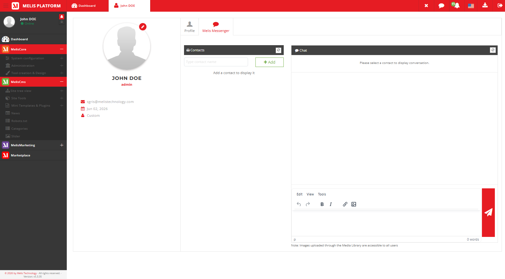
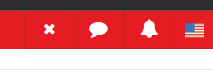

# MelisMessenger — Functional & Technical Documentation (for AI)

> **What this is.** MelisMessenger is an **internal messaging system** inside the platform so
> back-office collaborators can talk to each other: a **Messenger tab in your user Profile** for
> conversations, and a **header icon** that flags new messages from anywhere in the back-office.
>
> **Two parts:** **[Part A — Functional Guide](#part-a--functional-guide)** (users) ·
> **[Part B — Technical Reference](#part-b--technical-reference)** (developers/AI, with examples).
> Consumed by the **MelisAI** MCP; the **[Screenshot index](#screenshot-index)** maps filenames.
> Reviewed 2026-06-08.

---
---

# PART A — Functional Guide

## A1. What MelisMessenger lets you do

- **Message other platform users** — start a conversation with one or more colleagues.
- **Get notified** — a header icon shows new/unread messages wherever you are in the back-office.
- **Keep chatting** — conversations refresh automatically (roughly once a minute).

## A2. The Messenger tab (in your Profile)

**Where:** open your **user Profile** (top-right identity menu) → the **Messenger** tab (speech
bubbles icon).

There you see your **conversations**, the **message thread** of the selected one, a **contacts**
panel to start a new conversation (pick one or more people), and a box to **send** a message.


*The Messenger tab — conversations, the open thread, the contacts/recipient picker, and the send box.*

## A3. The header messages icon (notifications)

A **messages icon in the back-office header** shows your new/unread messages from any screen — so
you notice incoming messages without opening the Messenger tab.


*The header messages icon and its dropdown — new-message notifications across the back-office.*

## A4. Common tasks — "How do I…?"

- **Message a colleague** → Profile → **Messenger** tab → pick the person(s) in contacts → type
  and send.
- **See if I have new messages** → look at the **messages icon** in the header.
- **Read/continue a conversation** → Profile → Messenger → select the conversation.

---
---

# PART B — Technical Reference

## B1. Metadata & dependencies

| Item | Value |
|---|---|
| Package | `melisplatform/melis-messenger` · category **`core`** · namespace `MelisMessenger\` · dbdeploy |
| Requires | `melisplatform/melis-core` (`^5.2`) only |
| Recipient picker | **tokenize2** (`public/plugins/tokenize2.*`) |

A core-category module: conversations are between **platform users**, not tied to sites/pages.

## B2. Data model

| Table | Role | PK |
|---|---|---|
| `melis_messenger_msg` | A conversation (`msgr_msg_creator_id`, `msgr_msg_date_created`) | `msgr_msg_id` |
| `melis_messenger_msg_members` | A user in a conversation (`msgr_msg_id`, `msgr_msg_mbr_usr_id`) | `msgr_msg_mbr_id` |
| `melis_messenger_msg_content` | A message (`msgr_msg_cont_sender_id`, `…_message`, date, `…_status` for read/unread) | `msgr_msg_cont_id` |

Gateways: `MelisMessengerMsgTable`, `MelisMessengerMsgContentTable`, `MelisMessengerMsgMembersTable`.

## B3. Service `MelisMessengerService` (with examples)

```php
$messenger = $this->getServiceManager()->get('MelisMessengerService');

$convoId = $messenger->saveMsg($data);                       // create/update a conversation
$messenger->saveMsgMembers(['msgr_msg_id' => $convoId, 'msgr_msg_mbr_usr_id' => $userId]);
$messenger->saveMsgContent(['msgr_msg_id' => $convoId, 'msgr_msg_cont_message' => 'Hi']);

$thread = $messenger->getConversation($convoId);
$page   = $messenger->getConversationWithLimit($convoId, 10, 0);
$new    = $messenger->getNewMessage($convoId);               // since last poll
$messenger->updateMessageStatus($data, $msgId, $userId);     // mark read
$contacts = $messenger->getContactList($convoId, $userId);
```

Methods: `saveMsg`, `saveMsgMembers`, `saveMsgContent`, `getConversation`,
`getConversationWithLimit`, `getNewMessage`, `updateMessageStatus`, `getContactList`,
`prepareConversationId`, `getUserRightsForMessenger`. Read/list methods fire `*_start`/`*_end`
events (e.g. `melismessenger_get_conversation_start`/`_end`).

## B4. Tool, header, polling, form element

- **Controller**: `MelisMessengerController` — the Profile tab (`renderMessengerAction`,
  `renderMessengerToolContentAction`, `renderMessengerContactAction`), the header icon
  (`headerMessengerAction`), and the AJAX endpoints (`createConversationAction`,
  `saveMessageAction`, `getConversationAction`, `getNewMessageAction`, `getLastMessageAction`,
  `updateMessageStatusAction`, `getContactListAction`, `getMsgTimeIntervalAction`,
  `getUserRightsForMessengerAction`).
- **UI injection** (`config/app.interface.php`): the tab under `meliscore_user_profile_tabs`
  (`melismessenger_tool`, icon `comments`) and the header item under `meliscore_header`.
- **Polling**: the thread refreshes every `msg_interval` (default 60 000 ms).
- **Form element**: `MelisMessengerInput` (tokenize2 multi-recipient picker).

## B5. Quick code map

```
melis-messenger/
├── config/   module.config.php · app.interface.php (Profile tab + header icon) · app.forms.php · app.tools.php
├── src/   Controller/ (MelisMessenger, MelisSetup) · Service/MelisMessengerService
│        · Model/ + Model/Tables/ (msg / content / members) · Form/Factory/MelisMessengerInputFactory
├── view/ · public/ (tokenize2, tool JS/CSS) · language/ · install/ (SQL)
└── etc/   MarketPlace + MelisAI/doc (this doc)
```

---

## Screenshot index

| Image file | Content |
|---|---|
| `melismessenger-tool-profile-tab-messenger.png` | Messenger tab in the user Profile (thread + contacts + send) |
| `melismessenger-platformheader-iconmessenger.png` | Header messages icon — new-message notifications |

---

*Document for AI consumption (MelisAI MCP) — `melisplatform/melis-messenger`. Part A = functional;
Part B = technical with examples. Last reviewed 2026-06-08.*
